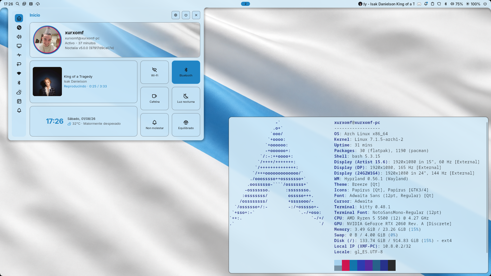
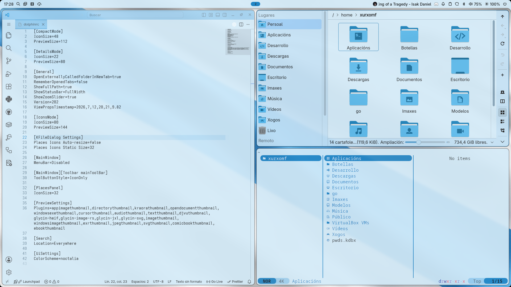
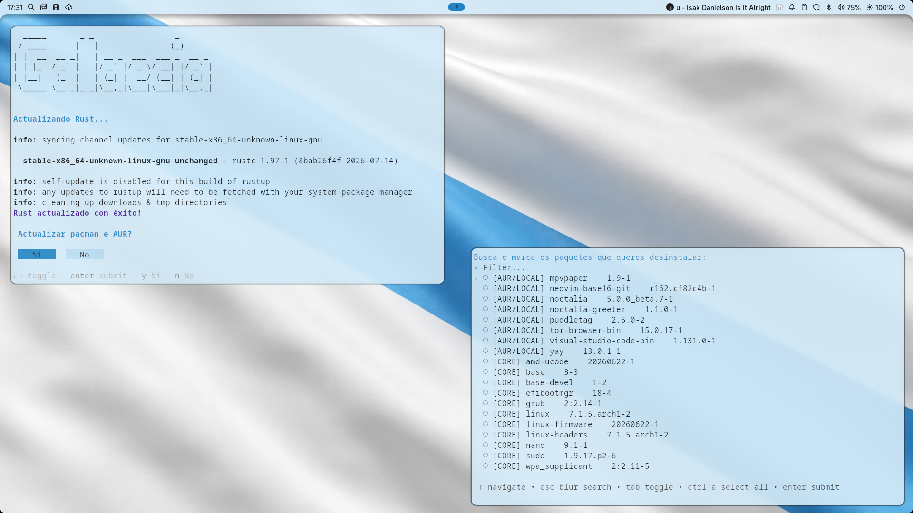
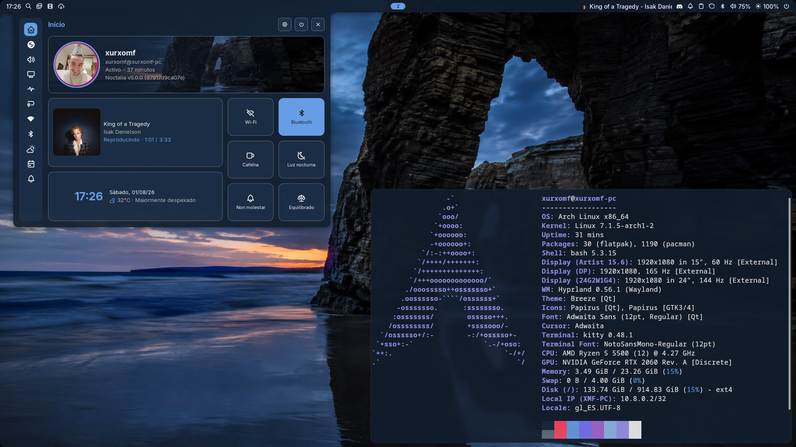
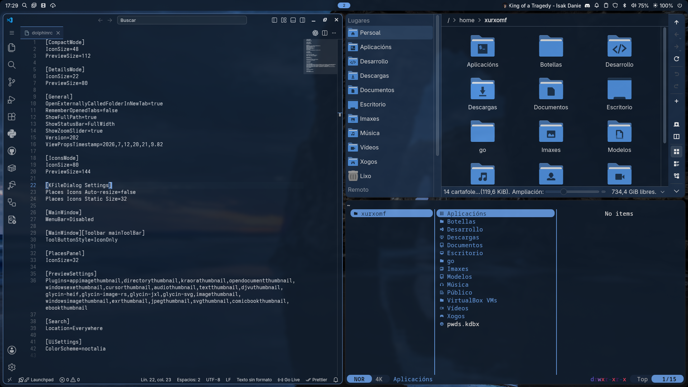
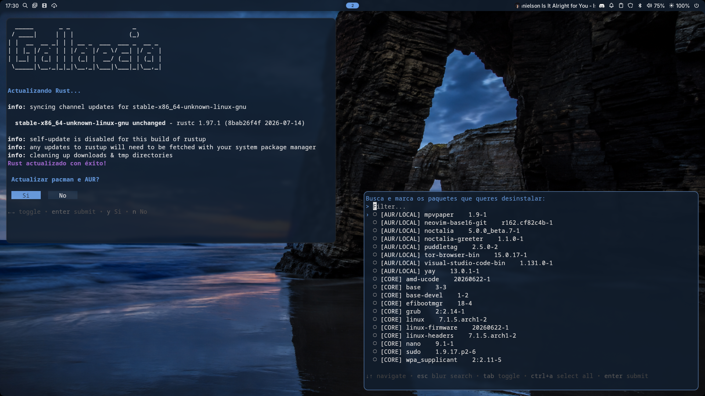
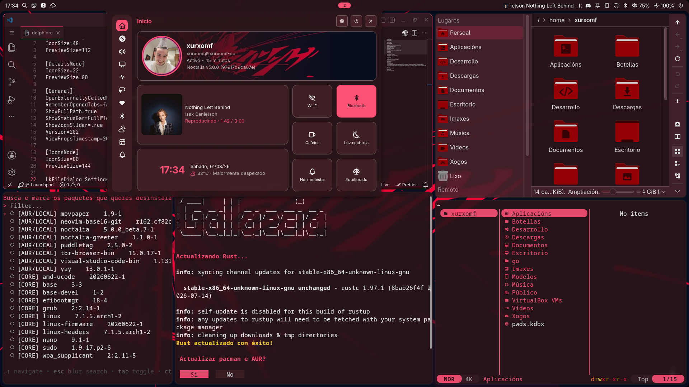

# 🌿 Gallaecia Dots

### Arch + Hyprland. En galego. Instalación mínima. Base actualizable.

Gallaecia Dots é un conxunto de dotfiles e un instalador interactivo para
montar rapidamente un escritorio baseado en **Arch Linux + Hyprland**, cunha
identidade galega e unha base concreta: **o mínimo imprescindible para arrancar
ben, con Noctalia e os paquetes esenciais xa preparados**.

Non pretende ser unha distribución nin unha capa pesada sobre o sistema. O
obxectivo é ofrecer un punto de partida pequeno, actualizable e fácil de manter.

## Índice

- [Galería](#galería)
  - [Tema claro](#tema-claro)
  - [Tema escuro](#tema-escuro)
  - [Tema extra](#tema-extra)
- [Que é Gallaecia Dots?](#que-é-gallaecia-dots)
- [Enfoque minimalista e _opinionated_](#enfoque-minimalista-e-opinionated)
- [Feito en galego](#feito-en-galego)
- [Que instala?](#que-instala)
  - [Núcleo obrigatorio](#núcleo-obrigatorio)
  - [Categorías e aplicacións](#categorías-e-aplicacións)
- [Referencia de comandos, funcións e alias](#referencia-de-comandos-funcións-e-alias)
  - [Dispoñibilidade e axuda](#dispoñibilidade-e-axuda)
  - [Aplicacións e paquetes](#aplicacións-e-paquetes)
  - [Comandos do sistema](#comandos-do-sistema)
  - [Rede e VPN](#rede-e-vpn)
  - [Comando Gallaecia](#comando-gallaecia)
  - [Ficheiros e directorios](#ficheiros-e-directorios)
  - [Interface con Gum](#interface-con-gum)
  - [Alias e configuración da shell](#alias-e-configuración-da-shell)
  - [Descargas con yt-dlp e SpotDL](#descargas-con-yt-dlp-e-spotdl)
  - [Git e GitHub](#git-e-github)
  - [Seguimento de directorios](#seguimento-de-directorios)
  - [Docker, Compose e Buildx](#docker-compose-e-buildx)
- [Guía de uso diario](#guía-de-uso-diario)
  - [Actualizar o sistema](#actualizar-o-sistema)
  - [Instalar máis aplicacións](#instalar-máis-aplicacións)
  - [Engadir e cambiar fondos](#engadir-e-cambiar-fondos)
  - [Atallos útiles](#atallos-útiles)
  - [Personalizar sen perder cambios](#personalizar-sen-perder-cambios)
- [Instalación](#instalación)
- [Instalación con archinstall](#instalación-con-archinstall)
- [Actualizacións e mantemento](#actualizacións-e-mantemento)
- [Estado do proxecto](#estado-do-proxecto)
- [Contribucións](#contribucións)
- [Licenza](#licenza)

## Galería

### Tema claro

<p align="center">
  <a href="assets/Gallaecia-Claro.png"></a>
  <a href="assets/Gallaecia-Claro-Apps.png"></a>
  <a href="assets/Gallaecia-Claro-Terminal.png"></a>
</p>

### Tema escuro

<p align="center">
  <a href="assets/Gallaecia-Escuro.png"></a>
  <a href="assets/Gallaecia-Escuro-Apps.png"></a>
  <a href="assets/Gallaecia-Escuro-Terminal.png"></a>
</p>

### Temas adaptables ao fondo de pantalla

<p align="center">
  <a href="assets/Gallaecia-Extra-Cores.png"></a>
</p>

## Que é Gallaecia Dots?

**Gallaecia Dots** combina:

- Un instalador que prepara o sistema paso a paso.
- Configuración base para Hyprland, Noctalia, greetd, GTK, Qt e portais XDG,
  entre outros.
- Unha selección mínima de paquetes fundamentais.
- Opcións para escoller só as aplicacións que de verdade queres instalar.

A idea é sinxela:

**Instalación curta, base sólida e liberdade para personalizar despois.**

## Enfoque minimalista e _opinionated_

Este proxecto non está pensado como un paquete completo de aplicacións para
todo o mundo. A visión é máis pequena e clara:

- Instalar só o esencial para que o escritorio funcione.
- Incluír **Noctalia** como peza central da experiencia.
- Manter configuracións que teñen sentido como base común.
- Deixar o resto como elección do usuario.

Primeiro instálase o núcleo e despois escóllense as ferramentas que interesan
en cada categoría.

## Feito en galego

O instalador, as configuracións propias e o escritorio utilizan o galego como
idioma principal. Durante a instalación, o sistema configura esta orde:

```text
Galego → Español → Inglés
```

Cando unha aplicación non dispoña de tradución ao galego, o sistema tentará
usar primeiro o español e despois o inglés. Tamén se inclúen fondos inspirados
en Galicia e na súa identidade.

## Que instala?

A instalación divídese entre un núcleo común e as aplicacións que escolle cada
usuario.

### Núcleo obrigatorio

- Hyprland.
- Noctalia e Noctalia Greeter.
- Tradutor integrado no launcher de Noctalia.
- Selector de cor integrado na barra de Noctalia mediante Hyprpicker.
- Fondos animados con MPV e mpvpaper.
- greetd.
- XDG Desktop Portals.
- PipeWire.
- NetworkManager e soporte para importar OpenVPN.
- GNOME Keyring e Seahorse para gardar e administrar contrasinais e claves.
- Overrides locais para ocultar do launcher utilidades técnicas de Qt, CMake,
  Avahi, hwloc, V4L2 e systemd.
- Kitty.
- Flatpak e Flathub.
- Yay para paquetes oficiais de Arch e AUR.
- Pipx para aplicacións Python illadas.
- Gum para os menús e formularios interactivos.
- Configuración GTK, Qt e XDG User Directories.
- Tipografías, iconas e dependencias comúns do escritorio.

> [!IMPORTANT]
> PAM crea o chaveiro `Login` no primeiro acceso con greetd e desbloquéao co
> contrasinal introducido en Noctalia Greeter. `Login` debe conservar o mesmo
> contrasinal que a conta do usuario e ser o chaveiro predeterminado. PAM non
> desbloquea directamente outro chaveiro só por marcalo como predeterminado.
> Podes revisalo ou cambiar o seu contrasinal desde Seahorse —«Contrasinais e
> claves»—.

### Categorías e aplicacións

As cinco primeiras categorías son obrigatorias e requiren polo menos unha
selección ou variante completa xa instalada. As demais son opcionais e poden
quedar baleiras. As categorías homoxéneas permiten escoller varias aplicacións
e definir unha predeterminada.

**Orixes empregadas:**

- **Yay/Pacman:** paquete oficial de Arch ou de AUR instalado mediante Yay.
- **Flatpak:** aplicación instalada desde Flathub.
- **Pipx:** aplicación Python instalada nun contorno illado.

| Categoría                                | Aplicacións dispoñibles                                                                                                                                                                                                                                                                              |
| ---------------------------------------- | ---------------------------------------------------------------------------------------------------------------------------------------------------------------------------------------------------------------------------------------------------------------------------------------------------- |
| **Terminal** · obrigatoria               | Kitty — Yay/Pacman (`kitty`)<br>Alacritty — Yay/Pacman (`alacritty`)<br>Foot — Yay/Pacman (`foot`)<br>Ghostty — Yay/Pacman (`ghostty`)<br>WezTerm — Yay/Pacman (`wezterm`)                                                                                                                           |
| **Editor de terminal** · obrigatoria     | Neovim — Yay/Pacman (`neovim`, `neovim-base16-git`)<br>Helix — Yay/Pacman (`helix`)<br>Vim — Yay/Pacman (`vim`)<br>Nano — Yay/Pacman (`nano`)<br>Micro — Yay/Pacman (`micro`)                                                                                                                        |
| **IDE ou editor gráfico** · obrigatoria  | Visual Studio Code — Yay/Pacman (`visual-studio-code-bin`)<br>Zed — Yay/Pacman (`zed`)<br>Obsidian — Yay/Pacman (`obsidian`)<br>Geany — Yay/Pacman (`geany`)                                                                                                                                         |
| **Navegador** · obrigatoria              | Firefox — Yay/Pacman (`firefox`)<br>LibreWolf — Yay/Pacman (`librewolf-bin`)<br>Zen Browser — Yay/Pacman (`zen-browser`)<br>Tor Browser — Yay/Pacman (`tor-browser-bin`)                                                                                                                             |
| **Explorador de arquivos** · obrigatoria | Dolphin — Yay/Pacman (`dolphin`, `ark`)<br>Nautilus — Yay/Pacman (`nautilus`)<br>Nemo — Yay/Pacman (`nemo`)<br>Yazi — Yay/Pacman (`yazi`)                                                                                                                                                            |
| **Audio**                                | Amberol — Yay/Pacman (`amberol`)<br>Tauon — Yay/Pacman (`tauon-music-box`)<br>VLC — Yay/Pacman (`vlc`, `vlc-plugins-all`)<br>MPV — Yay/Pacman (`mpv`)                                                                                                                                                |
| **Vídeo**                                | VLC — Yay/Pacman (`vlc`, `vlc-plugins-all`)<br>MPV — Yay/Pacman (`mpv`)<br>Clapper — Yay/Pacman (`clapper`)                                                                                                                                                                                          |
| **PDF**                                  | Okular — Yay/Pacman (`okular`)<br>Zathura — Yay/Pacman (`zathura`, `zathura-pdf-mupdf`)<br>Evince — Yay/Pacman (`evince`)                                                                                                                                                                            |
| **Imaxes**                               | Loupe — Yay/Pacman (`loupe`)<br>GIMP — Yay/Pacman (`gimp`)<br>Krita — Yay/Pacman (`krita`)                                                                                                                                                                                                           |
| **Correo**                               | Thunderbird — Yay/Pacman (`thunderbird`)                                                                                                                                                                                                                                                             |
| **Chat**                                 | Discord — Yay/Pacman (`discord`)<br>Vesktop — Yay/Pacman (`vesktop`)<br>Telegram — Yay/Pacman (`telegram-desktop`)<br>Element — Yay/Pacman (`element-desktop`)                                                                                                                                       |
| **Creatividade**                         | OBS Studio — Yay/Pacman (`obs-studio`)<br>Krita — Yay/Pacman (`krita`)<br>GIMP — Yay/Pacman (`gimp`)<br>Inkscape — Yay/Pacman (`inkscape`)<br>Blender — Yay/Pacman (`blender`)<br>Kdenlive — Yay/Pacman (`kdenlive`)<br>Puddletag — Yay/Pacman (`puddletag`)<br>HandBrake — Yay/Pacman (`handbrake`) |
| **Oficina e notas**                      | LibreOffice — Yay/Pacman (`libreoffice-still`, `libreoffice-still-gl`, `libreoffice-still-es`)<br>ONLYOFFICE — Yay/Pacman (`onlyoffice-bin`)<br>Obsidian — Yay/Pacman (`obsidian`)                                                                                                                                                |
| **Xogos e tendas**                       | Steam — Yay/Pacman (`steam`)<br>Prism Launcher — Yay/Pacman (`prismlauncher`)<br>Lutris — Yay/Pacman (`lutris`)<br>Bottles — Flatpak (`com.usebottles.bottles`)                                                                                                                                      |
| **Utilidades**                           | KeePassXC — Yay/Pacman (`keepassxc`)<br>qBittorrent — Yay/Pacman (`qbittorrent`)                                                                                                                                                                                                                     |
| **Desenvolvemento**                      | Git + GitHub CLI — Yay/Pacman (`git`, `github-cli`)<br>Docker + Compose — Yay/Pacman (`docker`, `docker-compose`, `docker-buildx`)<br>OpenCode — Yay/Pacman (`opencode`)<br>Bruno — Flatpak (`com.usebruno.Bruno`)<br>FileZilla — Yay/Pacman (`filezilla`)                                           |
| **Rede e privacidade**                   | Proton VPN — Flatpak (`com.protonvpn.www`)                                                                                                                                                                                                                                                           |
| **Descargas e personalización**          | yt-dlp — Yay/Pacman (`yt-dlp`)<br>SpotDL — Pipx (`spotdl`)                                                                                                                                                                                                                                           |

Os paquetes compartidos por varias categorías só se instalan unha vez.

> [!NOTE]
> Algúns templates de Noctalia, como os de Steam, Firefox ou Visual Studio Code,
> non poden aplicarse completamente de maneira automática porque necesitan
> extensións ou configuración manual na propia aplicación. Consulta a
> [guía de Noctalia v5](https://docs.noctalia.dev/v5/)
> para coñecer os requisitos e habilitar cada integración.

Gallaecia configura globalmente os wrappers `electronXX` de Arch para usar
GNOME Keyring mediante `gnome-libsecret`, xa que Electron non recoñece Hyprland
automaticamente como un escritorio con Secret Service. As aplicacións que
inclúen a súa propia copia de Electron, como VS Code, conservan a súa
configuración específica.

## Referencia de comandos, funcións e alias

### Dispoñibilidade e axuda

Os módulos públicos de aplicacións, comandos, ficheiros, rede e interface
cárganse en cada shell desde
`~/.local/share/gallaecia-dots/scripts/modules/`. Pódense usar nun terminal,
nun script persoal ou nun ficheiro `~/.config/bashrc/NNN-nome`.

Todos os comandos públicos admiten `-h` ou `--help`. Cando un wrapper permite
pasar argumentos ao programa orixinal, `--` separa as súas opcións:

```bash
docker-logs --follow -- --timestamps
git-log -- --since="1 week ago"
yt-dlp-video -- --cookies-from-browser firefox
```

Cada módulo rexistra tamén o autocompletado Bash dos seus propios comandos.
`Tab` completa subcomandos, opcións, valores coñecidos e rutas segundo o
contexto. Os completados de Git, Docker, yt-dlp e SpotDL só se cargan cando o
Bashrc opcional correspondente está instalado; despois de `--`, Bash recupera
o seu completado predeterminado.

Os nomes que comezan por `_` son helpers internos e non forman parte da API
pública. As librarías de `scripts/internal/` pertencen ao instalador e tampouco
se deben usar como API persoal.

### Aplicacións e paquetes

Estes helpers do módulo público `apps.sh` están sempre dispoñibles:

| Comando ou función  | Descrición                                                                                                                                   |
| ------------------- | -------------------------------------------------------------------------------------------------------------------------------------------- |
| `has_package`       | Comproba se un paquete está instalado con Yay/Pacman, Flatpak ou Pipx; permite limitar a comprobación cun xestor.                            |
| `yay-install`       | Explora e filtra o catálogo local de paquetes oficiais e AUR; `--refresh` actualízao e `--packages` instala nomes directamente.              |
| `flatpak-install`   | Explora o catálogo Flatpak e instala a selección confirmada; `--packages` instala directamente os IDs indicados.                             |
| `pipx-install`      | Valida en PyPI e instala unha aplicación Python illada; `--packages` instala directamente un ou máis nomes.                                  |
| `yay-uninstall`     | Selecciona paquetes explícitos e elimínaos con `yay -Rns`; `--clean-cache` permite limpar ademais a caché global de paquetes non instalados. |
| `flatpak-uninstall` | Elimina as apps seleccionadas e os runtimes sen uso; `--delete-data` permite borrar tamén datos persistentes tras unha segunda confirmación. |
| `pipx-uninstall`    | Elimina os contornos Pipx seleccionados xunto cos seus comandos e páxinas de manual, tanto do usuario como globais.                          |

### Comandos do sistema

Estes helpers do módulo público `commands.sh` están sempre dispoñibles:

| Comando ou función     | Descrición                                                                                         |
| ---------------------- | -------------------------------------------------------------------------------------------------- |
| `has_command`          | Indica se un comando existe no `PATH`.                                                             |
| `require_command`      | Esixe un comando e mostra un erro claro cando non está dispoñible.                                 |
| `require_commands`     | Esixe varios comandos e informa de todos os que faltan.                                            |
| `command_path`         | Devolve a ruta executable que resolvería a shell.                                                  |
| `package_owns_command` | Indica que paquete Yay/Pacman instalado proporciona un executable.                                 |
| `retry_command`        | Repite un comando un número configurable de veces e cunha espera configurable.                     |
| `run-terminal-as`      | Abre un comando nunha terminal nova cun `app_id` estable para poder aplicarlle regras de Hyprland. |

`command_path` e `package_owns_command` piden o comando cun input cando se
executan sen argumentos; `--command COMANDO` permite indicalo directamente.

### Rede e VPN

Noctalia cobre a conexión diaria, o estado de rede e a activación das VPN. O
módulo público `network.sh` completa a administración dos perfís de
NetworkManager:

| Comando           | Descrición                                                            |
| ----------------- | --------------------------------------------------------------------- |
| `vpn-list`        | Lista VPN e WireGuard con tipo, estado e UUID.                        |
| `vpn-import`      | Importa `.ovpn`, configuracións WireGuard ou outro tipo indicado.     |
| `vpn-rename`      | Cambia o nome visible dun perfil sen modificar o UUID.                |
| `vpn-clone`       | Duplica unha VPN cun nome e UUID novos.                               |
| `vpn-export`      | Exporta unha VPN mediante o plugin de NetworkManager correspondente.  |
| `vpn-autoconnect` | Asocia unha VPN a unha conexión base para iniciala automaticamente.   |
| `vpn-edit`        | Abre o editor avanzado e interactivo de `nmcli`.                      |
| `vpn-delete`      | Elimina un ou varios perfís despois dun selector e unha confirmación. |

Os comandos que actúan sobre un perfil permiten indicar o nome ou UUID e abren
un selector Gum cando se omite. `vpn-import` abre tamén un selector de ficheiros
por defecto; `--origin` permite indicar a configuración directamente. Por exemplo:

```bash
vpn-import
vpn-import --origin ~/Descargas/traballo.ovpn --name "VPN do traballo"
vpn-rename "VPN do traballo" "Oficina"
vpn-autoconnect Oficina "Wi-Fi da casa"
vpn-autoconnect --disable Oficina
vpn-export Oficina ~/Descargas/oficina.ovpn
vpn-delete Oficina
```

`vpn-import` necesita o plugin de NetworkManager correspondente ao formato. A
base instala soporte OpenVPN; para outros protocolos debes instalar o seu
plugin. NetworkManager non permite exportar perfís WireGuard mediante
`nmcli connection export`.

### Comando Gallaecia

O módulo público `gallaecia.sh` ofrece unha única función, `gallaecia`, para
as operacións propias do proxecto:

| Comando                      | Descrición                                                                       |
| ---------------------------- | -------------------------------------------------------------------------------- |
| `gallaecia --help`           | Mostra a referencia xeral e os subcomandos dispoñibles.                          |
| `gallaecia --version`        | Mostra a versión aplicada que ten rexistrada a instalación.                      |
| `gallaecia commands`         | Lista os subcomandos públicos cunha descrición breve.                            |
| `gallaecia update`           | Abre o actualizador completo do sistema e dos dotfiles.                          |
| `gallaecia reinstall`        | Sincroniza o repositorio e volve executar a instalación base tras confirmar.     |
| `gallaecia install-category` | Abre as categorías da versión instalada para engadir aplicacións ata premer Esc. |
| `gallaecia wallpaper-add`    | Clasifica e copia imaxes ou fondos animados no directorio correspondente.        |

Cada subcomando dispón da súa propia axuda, por exemplo
`gallaecia install-category --help`. As operacións internas de instalación
cárganse nun subshell e desaparecen da terminal ao finalizar.
`gallaecia wallpaper-add` abre un selector cando non recibe rutas e admite
`--origin RUTA` repetido para engadir varios fondos directamente.

### Ficheiros e directorios

Estes helpers do módulo público `files.sh` están sempre dispoñibles:

| Comando ou función | Descrición                                                               |
| ------------------ | ------------------------------------------------------------------------ |
| `replace_path`     | Elimina o destino e substitúeo por unha copia completa da orixe.         |
| `merge_path`       | Copia unha árbore sobre outra sen eliminar contido adicional do destino. |
| `replace_file`     | Substitúe un ficheiro concreto por outro.                                |
| `file_exists`      | Comproba que existe un ficheiro normal.                                  |
| `path_exists`      | Comproba que existe unha ruta de calquera tipo.                          |
| `directory_exists` | Comproba que existe un directorio.                                       |
| `symlink_exists`   | Comproba que existe unha ligazón simbólica.                              |
| `copy_file`        | Copia un ficheiro sen sobrescribir por defecto.                          |
| `copy_path`        | Copia unha árbore sen sobrescribir por defecto.                          |
| `ensure_directory` | Crea un directorio, incluídos os seus pais, se aínda non existe.         |
| `backup_path`      | Crea unha copia de seguridade cunha marca temporal.                      |
| `ensure_symlink`   | Crea ou actualiza unha ligazón simbólica de forma controlada.            |
| `trash_path`       | Envía unha ruta ao lixo para que a eliminación sexa recuperable.         |
| `files_equal`      | Compara dous ficheiros e indica se teñen o mesmo contido.                |

As operacións que necesitan unha orixe ou un destino abren `select_file`,
`select_folder` ou un input cando se omiten. Para saltar o fluxo interactivo usan
de forma consistente `--origin RUTA` e `--destination RUTA`; os argumentos
posicionais anteriores seguen admitidos. As operacións que modificarían
ficheiros ofrecen tamén `--dry-run` cando corresponde para revisar previamente
o resultado.

```bash
copy_file
copy_file --origin ./config.toml --destination ~/.config/app/config.toml
copy_path --origin ./config --destination ~/.config/app
```

### Interface con Gum

Estes wrappers do módulo público `ui.sh` están sempre dispoñibles e conservan
as cores xeradas por Noctalia:

| Comando ou función | Descrición                                                     |
| ------------------ | -------------------------------------------------------------- |
| `style`            | Aplica o estilo visual común a un texto.                       |
| `info`             | Mostra unha mensaxe informativa.                               |
| `title`            | Mostra un título de sección co espazado común.                 |
| `warning`          | Mostra unha advertencia.                                       |
| `error`            | Mostra un erro sen finalizar automaticamente o proceso.        |
| `success`          | Mostra unha mensaxe de éxito.                                  |
| `fail`             | Mostra un erro e finaliza o proceso con código `1`.            |
| `confirm`          | Pide unha confirmación Si/Non.                                 |
| `choose`           | Permite escoller unha ou varias opcións dunha lista.           |
| `input`            | Solicita unha liña de texto.                                   |
| `filter`           | Filtra e selecciona elementos dunha lista a pantalla completa. |
| `textarea`         | Abre un editor de texto multilínea.                            |
| `select_file`      | Permite seleccionar un ficheiro ou directorio.                 |
| `select_folder`    | Permite seleccionar unicamente un directorio.                  |
| `spinner`          | Mostra un indicador de progreso mentres se executa un comando. |
| `pager`            | Presenta texto nun visor desprazable.                          |
| `table`            | Formata datos como unha táboa interactiva.                     |
| `format`           | Renderiza texto cun formato compatible con Gum.                |
| `combine`          | Combina bloques de texto en horizontal ou vertical.            |
| `log`              | Mostra unha mensaxe de rexistro cun nivel determinado.         |

`choose`, `input`, `filter`, `textarea`, `select_file` e
`select_folder` aceptan directamente `--header TEXTO`; as demais opcións do
subcomando orixinal continúan situándose despois de `--`.

Os nomes anteriores co prefixo `gum_` mantéñense temporalmente como wrappers
de compatibilidade para scripts da serie 1.x, pero os comandos novos e a
documentación empregan os nomes curtos. `select_file`, `textarea` e `combine`
evitan ocultar respectivamente os comandos do sistema `file`, `write` e `join`.

Todos estes wrappers comparten unha paleta por roles visuais: texto principal
e secundario, bordo, acento, estados, prompt, cursor, cabeceira, elemento e
selección. As variables correspondentes expórtanse desde o template de
Noctalia, polo que un cambio de tema mantén unha aparencia coherente en todos
os comandos sen configurar cada un por separado.

As listas indican o foco cunha frecha `›` e, cando admiten varias seleccións,
empregan `●` para os elementos marcados e `○` para os desmarcados. Os títulos,
filas e demais elementos informativos non teñen fondo; este resérvase para as
zonas editables de `input` e `textarea` e para distinguir os botóns de
`confirm`. As cabeceiras comparten a cor de acento de `title`, as
advertencias usan o amarelo ANSI do terminal e todas as mensaxes de estado se
mostran sen separación vertical propia.

Os roles exportados son `FOREGROUND`, `BACKGROUND`, `MUTED_FOREGROUND`,
`MUTED_BACKGROUND`, `BORDER_FOREGROUND`, `BORDER_BACKGROUND`,
`ACCENT_FOREGROUND`, `SUCCESS_FOREGROUND`, `ERROR_FOREGROUND`,
`WARNING_FOREGROUND` e as parellas `PROMPT_*`, `CURSOR_*`, `HEADER_*`,
`ITEM_*`, `SELECTED_*` e `UNSELECTED_*`.

### Alias e configuración da shell

Estes alias e axustes cárganse sempre:

| Alias ou axuste              | Descrición                                                                   |
| ---------------------------- | ---------------------------------------------------------------------------- |
| `ls` → `ls --color=auto`     | Colorea os tipos de ficheiro nas listaxes.                                   |
| `grep` → `grep --color=auto` | Colorea as coincidencias das buscas.                                         |
| Autocompletado de `sudo`     | Permite completar tamén o comando situado despois de `sudo`.                 |
| Autocompletado de Pipx       | Activa o completado de comandos e opcións de Pipx.                           |
| `~/.local/bin` no `PATH`     | Fai accesibles os executables locais, incluídos os instalados mediante Pipx. |

### Descargas con yt-dlp e SpotDL

Estes comandos só existen se instalas a aplicación correspondente na categoría
**Descargas e personalización**:

| Aplicación necesaria | Comando        | Descrición                                                      |
| -------------------- | -------------- | --------------------------------------------------------------- |
| yt-dlp               | `yt-dlp-video` | Descarga vídeos coa configuración de YouTube de Gallaecia.      |
| yt-dlp               | `yt-dlp-music` | Descarga audio coa configuración de YouTube Music de Gallaecia. |
| SpotDL               | `spotdl-music` | Busca e descarga música mediante SpotDL.                        |

Os tres admiten URL, modo dunha soa descarga e argumentos adicionais para o
programa orixinal. Os vídeos descárganse directamente na carpeta actual; a
música organízase en subcarpetas de artista e álbum dentro dela. Consulta
`COMANDO --help` para ver todas as opcións.

### Git e GitHub

Estes comandos só existen se instalas **Git + GitHub CLI** na categoría
**Desenvolvemento**:

| Comando             | Descrición                                                                    |
| ------------------- | ----------------------------------------------------------------------------- |
| `git-credentials`   | Configura o nome e o correo da autoría de Git, no repositorio ou globalmente. |
| `github-login`      | Inicia sesión en GitHub mediante GitHub CLI.                                  |
| `git-init`          | Inicializa un repositorio solicitando o nome da rama inicial.                 |
| `git-clone`         | Clona un repositorio solicitando a URL e o directorio de destino.             |
| `git-status`        | Resume nunha táboa os estados e rutas dos cambios, sen mostrar os diffs.      |
| `git-add`           | Prepara cambios completos, interactivos ou ficheiros seleccionados.           |
| `git-commit`        | Crea un commit solicitando título e corpo.                                    |
| `git-save`          | Prepara os cambios e crea un commit nun único fluxo guiado.                   |
| `git-diff`          | Mostra os cambios do repositorio nun visor cómodo.                            |
| `git-pull`          | Descarga e integra os cambios remotos.                                        |
| `git-push`          | Publica a rama e configura o seu upstream cando é necesario.                  |
| `git-branch-switch` | Selecciona e cambia a outra rama.                                             |
| `git-branch-new`    | Crea unha rama e cambia a ela.                                                |
| `git-branch-delete` | Selecciona e elimina unha rama tras pedir confirmación.                       |
| `git-branch-merge`  | Selecciona e integra unha rama na actual tras pedir confirmación.             |
| `git-log`           | Mostra o historial compacto e gráfico do repositorio.                         |
| `git-commit-show`   | Selecciona un commit e mostra os seus detalles.                               |
| `git-stash-save`    | Garda temporalmente os cambios, opcionalmente tamén os non rastrexados.       |
| `git-stash-pop`     | Selecciona e recupera unha entrada do _stash_.                                |

Os inputs habituais poden indicarse directamente para saltar só eses pasos do
fluxo: `git-credentials` acepta `--name`, `--email` e `--scope`; `git-init`,
`--branch` e `--destination`; `git-commit`, `--title` e `--body`;
`git-branch-new`, `--branch`; e `git-stash-save`, `--message`. `git-clone`
mantén `--url` para o remoto e `--destination` para a copia local.

### Seguimento de directorios

Estes comandos permiten detectar cambios nun directorio sen convertelo nun
repositorio convencional. Gardan unha única referencia do estado dos ficheiros
e comparan con ela as revisións posteriores: non crean commits, ramas, historial
nin copias do contido. Requiren **Git + GitHub CLI** na categoría
**Desenvolvemento** porque empregan internamente o índice de Git.

| Comando        | Descrición                                                                   |
| -------------- | ---------------------------------------------------------------------------- |
| `track-save`   | Crea ou actualiza a referencia do estado actual do directorio.               |
| `track-status` | Lista os ficheiros engadidos, modificados e eliminados desde esa referencia. |
| `track-delete` | Retira o seguimento enviando o directorio `.track` ao lixo.                  |

`track-save` usa por defecto o directorio actual e admite `--origin` e varios
`--exclude`. O estado queda nun único `.track`, que contén só un índice de Git:
non garda o contido rastrexado. `track-status` e `track-delete` buscan esa raíz
desde o directorio actual ou aceptan `--origin`. Os directorios `.track` e
`.git` sempre quedan excluídos do seguimento. Ao volver executar `track-save`,
substitúese a referencia anterior tras confirmar; non se conservan versións
previas.

### Docker, Compose e Buildx

Estes comandos só existen se instalas **Docker + Compose** na categoría
**Desenvolvemento**:

| Comando                    | Descrición                                                       |
| -------------------------- | ---------------------------------------------------------------- |
| `docker-ps`                | Lista os contedores nunha táboa.                                 |
| `docker-shell`             | Abre unha shell dentro dun contedor en execución seleccionado.   |
| `docker-attach`            | Conecta a terminal ao proceso principal dun contedor.            |
| `docker-logs`              | Mostra ou segue os rexistros dun contedor seleccionado.          |
| `docker-container-start`   | Inicia un ou varios contedores seleccionados.                    |
| `docker-container-stop`    | Detén un ou varios contedores seleccionados.                     |
| `docker-container-restart` | Reinicia un ou varios contedores seleccionados.                  |
| `docker-container-delete`  | Elimina contedores seleccionados tras confirmar.                 |
| `docker-images`            | Lista as imaxes locais.                                          |
| `docker-image-delete`      | Elimina imaxes seleccionadas tras confirmar.                     |
| `docker-tag`               | Crea unha nova etiqueta para unha imaxe.                         |
| `docker-networks`          | Lista as redes de Docker.                                        |
| `docker-network-delete`    | Elimina redes seleccionadas tras confirmar.                      |
| `docker-volumes`           | Lista os volumes de Docker.                                      |
| `docker-volume-delete`     | Elimina volumes seleccionados con confirmación reforzada.        |
| `compose-ps`               | Mostra os servizos do proxecto Compose actual.                   |
| `compose-start`            | Inicia os contedores xa creados do proxecto Compose.             |
| `compose-stop`             | Detén os contedores do proxecto Compose sen eliminalos.          |
| `compose-up`               | Inicia os servizos de Compose.                                   |
| `compose-down`             | Detén e retira os servizos de Compose.                           |
| `compose-logs`             | Mostra ou segue os rexistros de Compose.                         |
| `compose-rebuild`          | Reconstrúe e inicia os servizos de Compose.                      |
| `compose-update`           | Descarga imaxes novas e actualiza os servizos de Compose.        |
| `docker-build`             | Constrúe unha imaxe con Buildx e permite seleccionar o contexto. |
| `docker-clean`             | Limpa recursos Docker non utilizados mediante un fluxo guiado.   |
| `docker-login`             | Inicia sesión nun rexistro de contedores.                        |
| `docker-logout`            | Pecha a sesión nun rexistro de contedores.                       |
| `docker-search`            | Busca imaxes nun rexistro.                                       |
| `docker-pull`              | Descarga unha imaxe.                                             |
| `docker-push`              | Publica unha imaxe nun rexistro.                                 |

As operacións de borrado piden confirmación. As accións forzadas ou que poden
eliminar datos importantes requiren unha segunda confirmación. Ao instalar
Docker tamén se activa `docker.service` e engádese o usuario ao grupo
`docker`; o acceso sen `sudo` queda dispoñible despois de reiniciar.

Os valores directos manteñen nomes comúns: `--image` para unha imaxe,
`--destination` para a nova referencia de `docker-tag`, `--registry` para
iniciar ou pechar sesión e `--query` para buscar. Se se omiten, os comandos
abren o selector ou input correspondente.

## Guía de uso diario

### Actualizar o sistema

Na barra de Noctalia hai un botón de actualización co símbolo de descarga.
Preme nel e o actualizador interactivo abrirase nunha terminal flotante e
centrada. A xanela recibe o `app_id` común `gallaecia.system-update`
independentemente de que a terminal predeterminada sexa Kitty, Alacritty, Foot,
Ghostty ou WezTerm. O fluxo permite:

1. Actualizar Rust e as súas ferramentas, se están instaladas.
2. Actualizar paquetes oficiais de Arch e AUR con Yay.
3. Actualizar aplicacións Flatpak.
4. Actualizar os plugins de Yazi, se Yazi está instalado.
5. Descargar os últimos cambios de Gallaecia Dots e aplicar só as migracións
   pendentes.
6. Reiniciar o equipo ao final, se o confirmas.

Cada bloque pide confirmación, polo que podes omitir o que non queiras executar.
Tamén podes abrir o mesmo fluxo manualmente:

```bash
gallaecia update
```

### Instalar máis aplicacións

Para volver abrir as categorías da instalación:

```bash
gallaecia install-category
```

Primeiro escolles unha categoría. As variantes completas xa presentes móstranse
baixo `Xa instaladas:` e ocúltanse do selector; se unha variante require varios
paquetes, considérase instalada unicamente cando están todos. Ao rematar, o menú
de categorías aparece de novo ata que premas Esc. O comando non desinstala as
aplicacións anteriores. Cada categoría instala inmediatamente os novos paquetes
e configuracións antes de volver ao menú. Emprega exclusivamente as categorías
e aplicacións dispoñibles na versión xa instalada, sen sincronizar o repositorio.

Cando unha categoría admite aplicación predeterminada, o selector inclúe tanto
as variantes xa instaladas como as que se acaban de escoller. En IDE, Navegador
e Explorador de arquivos úsase a mesma app tanto para os MIME como para
Hyprland. Terminal e Editor de terminal actualizan só Hyprland porque non teñen
regras MIME equivalentes. Yazi rexistra `yazi.desktop` para abrir directorios e
Hyprland lánzao sempre con `$TERMINAL -e yazi`, polo que segue automaticamente
o terminal predeterminado tras reiniciar a sesión. A súa configuración inclúe
o lixo integrado de Yazi (`g t`), a creación múltiple de ficheiros (`A`), o
historial das entradas e a paleta de comandos da axuda de Yazi 26.8.15.

As asignacións de Hyprland actualízanse aínda que o placeholder da instalación
inicial xa teña un valor. As regras MIME existentes substitúense e as que
falten créanse. Nas categorías homoxéneas, cando varias apps activas comparten
un MIME, este queda na predeterminada; os MIME exclusivos das demais
consérvanse. Creatividade, Oficina e notas, Xogos e tendas e Utilidades non
piden unha predeterminada común: aplican os MIME propios de cada app na orde da
categoría e o usuario pode cambiar despois calquera coincidencia.

Para retirar aplicacións ou paquetes xa instalados están dispoñibles
`yay-uninstall`, `flatpak-uninstall` e `pipx-uninstall`. Os tres mostran só as
apps xa instaladas, permiten marcar varias e sempre ensinan a información e
piden confirmación antes de borrar. Usa `COMANDO --help` para ver a limpeza
específica de cada xestor e o modo directo `--packages`.

Tamén podes indicar directamente o identificador dunha categoría:

```bash
gallaecia install-category development
```

### Engadir e cambiar fondos

Gallaecia separa os fondos estáticos dos animados:

> [!NOTE]
> Algúns dos fondos incluídos foron xerados con intelixencia artificial debido
> á escaseza de imaxes de Galicia con boa calidade e licenzas compatibles coa
> súa redistribución.

| Tipo             | Directorio persoal     |
| ---------------- | ---------------------- |
| Imaxes estáticas | `~/.wallpapers/`       |
| Vídeos animados  | `~/.wallpaper-videos/` |

> [!NOTE]
> O nome correcto do directorio de vídeos é `.wallpaper-videos`, en singular.

Para engadir un ou varios fondos podes usar:

```bash
gallaecia wallpaper-add ~/Imaxes/fondo.jpg
gallaecia wallpaper-add ~/Vídeos/fondo.mp4
gallaecia wallpaper-add ~/Imaxes/outro.webp ~/Vídeos/outro.webm
```

O comando recoñece como imaxes `.jpg`, `.jpeg`, `.png`, `.webp`, `.avif` e
`.bmp`, que copia a `~/.wallpapers/`. Os formatos `.mp4`, `.webm`, `.mkv`,
`.mov` e `.gif` considéranse fondos animados e van a
`~/.wallpaper-videos/`. Calquera outra extensión produce un erro sen copiar
ningún dos ficheiros recibidos nesa execución.

Despois abre o selector de fondos desde a barra de Noctalia e escolle o novo
ficheiro. Ao cambiar un fondo estático, Noctalia rexenera tamén a paleta
dinámica empregada polo escritorio e polos menús de Gum. Os fondos animados
utilizan MPV e mpvpaper, instalados obrigatoriamente polo núcleo.

### Atallos útiles

| Atallo             | Acción                                         |
| ------------------ | ---------------------------------------------- |
| `Super` + `Espazo` | Abrir o launcher de Noctalia.                  |
| `Super` + `V`      | Abrir o historial do portapapeis.              |
| `Super` + `T`      | Abrir a terminal predeterminada.               |
| `Super` + `B`      | Abrir o navegador predeterminado.              |
| `Super` + `E`      | Abrir o explorador de arquivos predeterminado. |
| `Super` + `C`      | Abrir o IDE ou editor gráfico predeterminado.  |
| `Print`            | Capturar unha rexión da pantalla.              |
| `Shift` + `Print`  | Capturar todos os monitores.                   |
| `Alt` + `Print`    | Capturar o monitor actual.                     |

O launcher de Noctalia inclúe tamén o tradutor engadido por Gallaecia. A barra
ofrece ademais un selector de cor que emprega Hyprpicker.

### Personalizar sen perder cambios

- Engade funcións, alias ou variables propios en
  `~/.config/bashrc/NNN-nome`; non edites o `.bashrc` principal.
- Personaliza Noctalia en `~/.config/noctalia/custom.toml`. A base actualizable
  vive en `gallaecia.toml`.
- Mantén os cambios persoais de Hyprland en
  `~/.config/hypr/hyprland.lua`; a base compartida vive en
  `~/.local/share/gallaecia-dots/hypr/gallaecia.lua`.
- Consulta `COMANDO --help` antes de automatizar un helper público: a axuda
  documenta parámetros, códigos de saída e passthrough.

## Instalación

> [!WARNING]
> O instalador modifica e substitúe diferentes ficheiros de configuración do
> sistema e do usuario. Recoméndase utilizalo sobre unha instalación limpa de
> Arch Linux, sen contorno gráfico previo.

Executa:

```bash
bash <(curl -fsSL https://raw.githubusercontent.com/XurxoMF/gallaecia-dots/release/install.sh)
```

O instalador guiarate paso a paso cunha interface interactiva.

> [!IMPORTANT]
> Se tras reiniciar ao rematar a instalación aparece un erro de Hyprland ou
> algunha aplicación non funciona correctamente, reinicia de novo ou volve
> seleccionar un wallpaper para que Noctalia rexenere as paletas de cores.

## Instalación con archinstall

Se prefires preparar a instalación base con `archinstall`, inicia o equipo co
USB de Arch Linux, abre unha consola e descarga o perfil do proxecto:

```bash
curl -fsSL -o user_configuration.json https://raw.githubusercontent.com/XurxoMF/gallaecia-dots/release/archinstall/user_configuration.json
```

Despois lanza:

```bash
archinstall --config user_configuration.json
```

Se a túa versión de `archinstall` emprega outro modo para cargar perfís,
selecciona a opción de importar configuración e usa o mesmo ficheiro. Durante o
asistente só queda:

1. Crear o usuario normal.
2. Poñer o contrasinal de `root`.
3. Escoller o particionamento dos discos.

Cando remate a instalación base, reinicia, entra co teu usuario e executa o
instalador de Gallaecia Dots para deixar o escritorio preparado.

## Actualizacións e mantemento

A base común de Gallaecia Dots é actualizable. As instalacións novas reciben
directamente o estado máis recente e as existentes aplican, por orde, só as
migracións que aínda non teñen rexistradas.

O actualizador conserva a separación entre:

- Ficheiros controlados polo proxecto, que poden recibir melloras.
- Configuración persoal, que debe vivir nas rutas indicadas na
  [guía de personalización](#personalizar-sen-perder-cambios).

Podes editar a túa configuración, borrar o que non uses e engadir as túas
propias pezas. O proxecto non pretende ocultar como está montado Arch.

## Estado do proxecto

Gallaecia Dots é un proxecto persoal en desenvolvemento. Pode haber cambios
importantes entre versións e algunhas actualizacións de Arch Linux, Hyprland ou
outros compoñentes poden requirir axustes manuais.

Se algo rompe:

**Benvido a Arch.** 🫡

## Contribucións

As propostas, correccións e melloras son benvidas. Podes abrir unha _issue_ ou
enviar unha _pull request_ a través de GitHub.

Ao engadir ou retirar aplicacións, comandos, funcións, alias ou apartados,
actualiza tamén os catálogos e o índice deste README no mesmo cambio.

## Licenza

Baixo a licenza MIT podes facer o que queiras con este contido. Agradeceríase
que, se fas un _fork_ ou algo similar, menciones a autoría orixinal.
